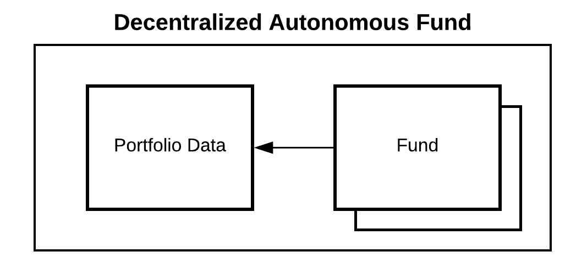

[](https://circleci.com/gh/cryptofinlabs/bskt-daf)


# The Decentralized Autonomous Fund (DAF)

**tl;dr** A trustless, self-rebalancing fund that holds one or more Ethereum ERC20 tokens

## Overview

The **Decentralized Autonomous Fund** (DAF) allows anyone to hold a cryptocurrency token that is
composed of underlying cryptocurrency tokens.

The key benefits of the DAF are that it:

- Represents many ERC20 tokens with a single ERC20 token
- Allows rebalacing, with easy entry and exit from the fund before rebalancing commences
- Connects to existing centralized and decentralized ERC20 exchanges

The DAF has some of the same benefits as existing real world funds, like hedge funds, mutual funds,
and exchange traded funds (ETFs).

## How it Works

The DAF is divided into a *portfolio data component* and a *fund component*:



The *portfolio data component* manages the portfolio composition. The *fund component* manages token
issuance, token redemption, and rebalancing based on the current data in the *portfolio data contract*.

### Portfolio Data Component

The *portfolio data component* allows one or more data managers to regularly select one or more
ERC20 tokens and their balances. In exchange for this oracle service, data managers receive fees to
read the oracle data on chain. Thie data manager can also be easily replaced by a community voting
mechanism, such as a [token curated registry](https://medium.com/@ilovebagels/token-curated-registries-1-0-61a232f8dac7) (TCR).

### Fund Component

The *fund component* allows anyone to create/redeem fund tokens that reflect the portfolio data
component and is ERC20 compliant. To create means to exchange underlying tokens for the fund token.
To redeem means to exchange fund tokens for the underlying.

The fund has three main stages:

1. **Idle**: In the idle state, anyone can create or redeem fund tokens for the underlying tokens
2. **Wait**: During the wait period, the *data component* is read — and the new composition is stored for the next rebalance; all fund token holders have the ability to redeem during this period if they disagree with the new composition
3. **Rebalance**: During the rebalance, an English auction is held to convert the existing collateral to the new collateral; at the end of the period, existing collateral is given to the auction winner, in exchange for the collateral that gets the fund closest to the new composition. During the rebalance, fund tokens cannot be created or redeemed. If no one submits a bid, the fund retains its existing tokens
For more details, see our [whitepaper](./whitepaper/Bskt%20Decentralized%20Autonomous%20Fund.pdf).

When changes are made to the composition in the *portfolio data component*, the *fund component*
will wait for a period of time ("opt out window") before beginning an auction to rebalance to the
new composition. During the opt out window, anyone holding fund tokens who disagrees can redeem to
exit the fund — or sell the fund tokens on exchanges.

### Example: The Ethereum 10

A *data manager* creates a *portfolio data contract* that lists the top 10 Ethereum tokens by market
cap. On a quarterly basis, the manager updates the tokens and weights to represent the current top 10.
They receive ether from any party that wants to access the data.

Anyone can deploy a *fund* that represents the top 10 Ethereum tokens by market cap. This fund is
paired to the existing data contract, and reads it at the end of every quarter. When a rebalance is
about to occur, the fund reads the existing data. It then waits for two days ('wait period'), so
token holders can decide if they want to redeem and exit the fund.

Once the two day rebalance period starts, token creation and redemption are paused. During this period,
market makers can submit bids to convert the existing composition to the new composition. Each bid,
requires transferring the underlying collateral to the contract. Once the rebalance period end,
a winner is chosen — and creation/redemption is unpaused.

## To Use

### Deployment


### Testing
```
npm install
npm run test
```

